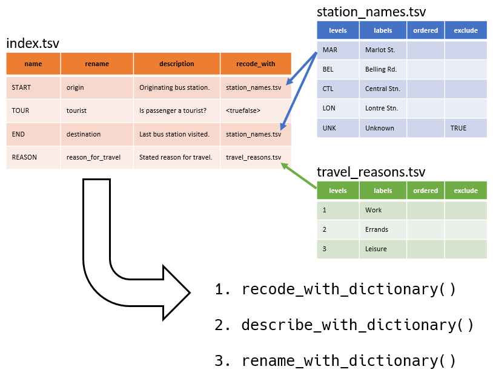

Labelling datasets using a data dictionary, with `tsv2label`
================
Desi Quintans
2023-11-01

- [Installation](#installation)
- [List of functions](#list-of-functions)
  - [Order of operations](#order)
- [Example: Describing the Poker Hands
  dataset](#example-describing-the-poker-hands-dataset)
  - [The raw data](#the-raw-data)
  - [What does a dictionary look
    like?](#what-does-a-dictionary-look-like)
    - [Index file](#index-file)
    - [Converters](#converters)
    - [Mapping spreadsheets](#mapping-spreadsheets)
  - [Reading a dictionary](#reading-a-dictionary)
  - [Step 1: Recode variables](#step-1-recode-variables)
  - [Step 2: Add labels/descriptions to
    variables](#step-2-add-labelsdescriptions-to-variables)
  - [Step 3: Rename variables](#step-3-rename-variables)
- [Appendix](#appendix)
  - [Formal definition of a `tsv2label` data dictionary](#formal)
    - [File structure](#file-structure)
    - [Contents of `index` file](#contents-of-index-file)
    - [Contents of mapping
      spreadsheets](#contents-of-mapping-spreadsheets)

------------------------------------------------------------------------

# Installation

``` r
# CRAN coming soon

# Install from GitHub for up-to-date changes
# install.packages("pak")
pak::pak("DesiQuintans/tsv2label")

library(tsv2label)  # Load it up!
```

If you’ve ever tried to find your way through a dataset with cryptic
names and values, you’ve probably made a spreadsheet that had columns
like: 1) variable name, 2) what it contains, 3) what its types are,
especially if it looks like they are coding for something.

`tsv2label` lets you use such a spreadsheet to label, rename, and recode
your dataset automatically; especially helpful if your dataset is
hundreds of columns wide.

It uses tab-delimited spreadsheets (and not CSVs or XLSXs) because they are:

1. Editable in Excel
2. Easy to assemble by copying and pasting from existing messy data dictionaries
3. Can be cleaned and reshaped in your favourite text editor using regular expressions and multiple
cursors, and
4. They can be tracked and diffed with version control software.



------------------------------------------------------------------------

# List of functions

`tsv2label` gives you four main functions:

| Function                             | Description                              |
|:-------------------------------------|:-----------------------------------------|
| `recode_with_dictionary(df, path)`   | Convert variables to other data types    |
| `describe_with_dictionary(df, path)` | Add descriptions (labels) to variables   |
| `rename_with_dictionary(df, path)`   | Rename variables                         |
|                                      |                                          |
| `revert_colnames(df, path)`          | Return variables to their original names |

## Order of operations

The order that these functions should be applied is:

1.  `recode_with_dictionary()`
2.  `describe_with_dictionary()`
3.  `rename_with_dictionary()`
4.  `revert_colnames()`

This is because when `recode_with_dictionary()` converts variables, any
labels associated with them are lost. And when
`rename_with_dictionary()` renames variables, `recode_with_dictionary()`
and `describe_with_dictionary()` can no longer find and act on them.

------------------------------------------------------------------------

# Example: Describing the Poker Hands dataset

## The raw data

``` r
library(tsv2label)
```

`tsv2label` ships with a built-in dataset called `poker`, which is a
subset of the [Poker
Hand](https://archive.ics.uci.edu/ml/datasets/Poker+Hand) dataset with
some added columns:

``` r
head(poker)
```

    ##   ID S1 C1 S2 C2 S3 C3 S4 C4 S5 C5 CLASS    CAT COIN FLIP LIST_COL LOGICAL_CHAR LOGICAL_INT yesno
    ## 1  1  1 10  1 11  1 13  1 12  1  1     9  Socks     FALSE  n, s, p            t           0    No
    ## 2  2  2 11  2 13  2 10  2 12  2  1     9   Fred     FALSE  z, x, k          YES          NA  <NA>
    ## 3  3  3 12  3 11  3 13  3 10  3  1     9 Fluffy      TRUE  x, b, v         <NA>           1    No
    ## 4  4  4 10  4 11  4  1  4 13  4 12     9   Nala      TRUE  k, f, g        apple           2    No
    ## 5  5  4  1  4 13  4 12  4 11  4 10     9   Cher      TRUE  j, q, h        FaLsE          -1   Yes
    ## 6  6  1  2  1  4  1  5  1  3  1  6     8   Lily      TRUE  g, f, a           No          NA  <NA>

There are many coded values here that need to be converted to other data
types (for example, `S1` should be “Clubs”, “Diamonds”, etc., and
`LOGICAL_CHAR` should be recoded as `TRUE` and `FALSE`). The column
names are cryptic, and the dataset has no variable labels which would
aid in exploration, especially when using a label-aware exploration
package like [`siftr`](https://github.com/DesiQuintans/siftr/).

Luckily, `tsv2label` ships with the data dictionary for this dataset, in
both .ZIP and folder forms (`tsv2label` can read directly from both):

``` r
# system.file() looks inside tsv2label's installed location to see the files 
# that came with it. 

system.file("extdata", package = "tsv2label") |> list.files()
```

    ## [1] "poker"     "poker.zip"

## What does a dictionary look like?

A data dictionary is a directory or .ZIP file with no subfolders, which
contains tab-delimited spreadsheets in either *.TSV* or *.TXT* format.

``` r
system.file("extdata/poker", package = "tsv2label") |> list.files()
```

    ## [1] "index.tsv"        "values_flip.tsv"  "values_hands.tsv" "values_ranks.tsv" "values_suits.tsv"

The Appendix below has the [formal definition of a
dictionary](#formal-definition-of-a-tsv2label-data-dictionary), but the
easiest way to understand what should be in a dictionary is by looking
at `poker`’s.

### Index file

The central file is called `index`; it must always exist, and must be a
tab-delimited file in *.TSV* or *.TXT* format.

``` r
system.file("extdata/poker/index.tsv", package = "tsv2label") |> read.delim()
```

    ##            name          rename                                     description  recode_with
    ## 1            ID      random_int                           Some random integers.             
    ## 2            S1         c1_suit                                 Suit of card #1 values_suits
    ## 3            C1         c1_rank                                 Rank of card #1 values_ranks
    ## 4            S2         c2_suit                                 Suit of card #2 values_suits
    ## 5            C2         c2_rank                                 Rank of card #2 values_ranks
    ## 6            S3         c3_suit                                 Suit of card #3 values_suits
    ## 7            C3         c3_rank                                 Rank of card #3 values_ranks
    ## 8            S4         c4_suit                                 Suit of card #4 values_suits
    ## 9            C4         c4_rank                                 Rank of card #4 values_ranks
    ## 10           S5         c5_suit                                 Suit of card #5 values_suits
    ## 11           C5         c5_rank                                 Rank of card #5 values_ranks
    ## 12        CLASS hand_from_cards                          Poker hand (cards 1-5) values_hands
    ## 13          CAT                                               Random cat names.             
    ## 14    COIN FLIP       coin_flip                          Outcome of a coinflip.  values_flip
    ## 15    not_exist                                          Column not in dataset.             
    ## 16 LOGICAL_CHAR                 Characters that are truthy, falsy, and neither.  <truefalse>
    ## 17  LOGICAL_INT                   Integers that are truthy, falsy, and neither. <noyes-lazy>
    ## 18        yesno                                     Yeses and Nos and Missings.  <truefalse>

It must have these four columns in any order (all other columns are
ignored):

1.  `name` is the name of a column/variable in your dataset.
2.  `rename` is what to rename the column. Leave it blank if unneeded.
3.  `description` is a human-readable description of what the variable
    is about. Leave it blank if unneeded.
4.  `recode_with` is used to convert raw data into other data types,
    such as Logical and Factor. It accepts one of three things:
    1.  Nothing (empty), which means that the column will not be
        recoded.
    2.  The filename of a **mapping spreadsheet** in the same folder
        (with or without file extension) that describes how levels are
        mapped to labels, e.g. postal codes to suburb names.
    3.  The name of a **<converter>**, which is a built-in way to handle
        common recoding operations. A list of accepted ones is given
        below.

As you can see, one mapping spreadsheet or converter can be applied to
many columns.

### Converters

Converters are built-in methods for the most common recoding operations.
The package treats anything wrapped in *<angle brackets>* as a
converter. Currently accepted converters are:

#### Convert 1/0/yes/no/true/false values

These conversions ignore case. ‘Truthy’ values are
`{1, y, yes, t, true}`. ‘Falsy’ values are `{0, n, no, f, false}`.

- **`<truefalse>`** — Converts truthy values to `TRUE`, falsy values to
  `FALSE`, everything else (including `NA`) to `NA`.

- **`<truefalse-lazy>`** — Converts truthy values to `TRUE` and
  everything else to `FALSE`, but preserves `NA` as `NA`.

- **`<yesno>`** — Converts truthy values to factor level `"Yes"`, falsy
  values to factor level `"No"`, and everything else (including `NA`) to
  `NA`. `"Yes"` is the first factor level.

- **`<noyes>`** — Same as above, but with `"No"` as the first factor
  level.

- **`<yesno-lazy>`** — Converts truthy values to factor level `"Yes"`
  and everything else to factor level `"No"`, but preserves `NA` as
  `NA`. `"Yes"` is the first factor level.

- **`<noyes-lazy>`** — Same as above, but with `"No"` as the first
  factor level.

### Mapping spreadsheets

The mapping spreadsheets control how a variable is going to be converted
to a Factor type. mapping spreadsheet must be tab-delimited files in
*.TSV* or *.TXT* format, just like the Index file is.

``` r
system.file("extdata/poker/values_suits.tsv", package = "tsv2label") |> read.delim()
```

    ##   levels   labels ordered
    ## 1      1   Hearts   FALSE
    ## 2      2   Spades      NA
    ## 3      3 Diamonds      NA
    ## 4      4    Clubs      NA

It must have these two columns in any order:

1.  `levels` contains the raw values in your dataset. It is used as the
    levels of the new factor.
2.  `labels` contains the label to apply to each level.

Another two columns are optional, and can be presented in any order:

3.  `ordered` controls whether this will be created as an ordered
    factor. An affirmative value (case-insensitive: `true`, `t`, `yes`,
    `y`, or `1`) in *any* cell of this column will make it an ordered
    factor.
4.  `exclude` controls whether a level is excluded from the final factor
    (i.e. converted to `NA`). An affirmative value (case-insensitive:
    `true`, `t`, `yes`, `y`, or `1`) in the same row as a level will
    exclude that level.

The columns are named after their matching arguments in `factor()`:

``` r
str(factor)
```

    ## function (x = character(), levels, labels = levels, exclude = NA, ordered = is.ordered(x), 
    ##     nmax = NA)

Any other columns are ignored.

## Reading a dictionary

`tsv2label` can read dictionaries from both folders and .ZIP files. The
latter is convenient because it lets you distribute a dictionary as a
single .ZIP file.

`tsv2label` functions have a `path` argument to tell them where the
dictionary is:

``` r
# To read from a folder, use the path to the folder:
recode_with_dictionary(df = my_data, path = "C:/path/to/dictionary/folder")

# To read from a .ZIP, use the path to the .ZIP (it will unzip automatically):
recode_with_dictionary(df = my_data, path = "C:/path/to/my_dictionary.zip")
```

For this example, let’s read the dictionary from the folder.

``` r
dictionary_dir <- system.file("extdata/poker", package = "tsv2label")
dictionary_dir
```

    ## [1] "C:/Users/dqui6184/AppData/Local/R/win-library/4.3/tsv2label/extdata/poker"

If you were using your own data dictionary, then this would be a path to
its location on your computer.

## Step 1: Recode variables

Recoding always comes first in our [order of
operations](#order-of-operations).

``` r
recode_with_dictionary(df = poker, path = dictionary_dir)
```

    ##   (1/6)  Using '<noyes-lazy>' for LOGICAL_INT.

    ##   (2/6)  Using '<truefalse>' for LOGICAL_CHAR, yesno.

    ##   (3/6)  Using 'values_flip' for COIN FLIP.

    ##   (4/6)  Using 'values_hands' for CLASS.

    ##   (5/6)  Using 'values_ranks' for C1, C2, C3, C4, C5.

    ##   (6/6)  Using 'values_suits' for S1, S2, S3, S4, S5.

    ##   Peeking at 'levels(poker[["LOGICAL_INT"]])', built from '<noyes-lazy>':

    ##   No, Yes

    ##   Peeking at 'unique(poker[["LOGICAL_CHAR"]])', built from '<truefalse>':

    ##   TRUE, NA, FALSE

    ##   Peeking at 'levels(poker[["COIN FLIP"]])', built from 'values_flip':

    ##   Heads, Tails

    ##   Peeking at 'levels(poker[["CLASS"]])', built from 'values_hands':

    ##   Nothing in hand, One pair, Two pairs, Three of a kind, Straight, Flush, Full house, 
    ##   Four of a kind, Straight flush, Royal flush

    ##   Peeking at 'levels(poker[["C1"]])', built from 'values_ranks':

    ##   Ace, 2, 3, 4, 5, 6, 7, 8, 9, 10, Jack, Queen, King

    ##   Peeking at 'levels(poker[["S1"]])', built from 'values_suits':

    ##   Hearts, Spades, Diamonds, Clubs

Note that we didn’t have to assign the result to a name; all `tsv2label`
functions avoid expensive copying by modifying the dataframe in-place.

Any column that had a `recode_with` associated with it in `index` will
be recoded:

``` r
head(poker)
```

    ##   ID       S1    C1       S2   C2       S3    C3       S4    C4       S5    C5          CLASS
    ## 1  1   Hearts    10   Hearts Jack   Hearts  King   Hearts Queen   Hearts   Ace    Royal flush
    ## 2  2   Spades  Jack   Spades King   Spades    10   Spades Queen   Spades   Ace    Royal flush
    ## 3  3 Diamonds Queen Diamonds Jack Diamonds  King Diamonds    10 Diamonds   Ace    Royal flush
    ## 4  4    Clubs    10    Clubs Jack    Clubs   Ace    Clubs  King    Clubs Queen    Royal flush
    ## 5  5    Clubs   Ace    Clubs King    Clubs Queen    Clubs  Jack    Clubs    10    Royal flush
    ## 6  6   Hearts     2   Hearts    4   Hearts     5   Hearts     3   Hearts     6 Straight flush
    ##      CAT COIN FLIP LIST_COL LOGICAL_CHAR LOGICAL_INT yesno
    ## 1  Socks     Tails  n, s, p         TRUE          No FALSE
    ## 2   Fred     Tails  z, x, k         TRUE        <NA>    NA
    ## 3 Fluffy     Heads  x, b, v           NA         Yes FALSE
    ## 4   Nala     Heads  k, f, g           NA          No FALSE
    ## 5   Cher     Heads  j, q, h        FALSE          No  TRUE
    ## 6   Lily     Heads  g, f, a        FALSE        <NA>    NA

In real-world conditions, the Factors that are generated may have unused
factor levels. For example, imagine recoding a variable called
`country_of_residence` using a mapping spreadsheet that has hundreds of
countries, but everyone in your dataset resides in Australia so none of
the other country levels are used at all. If you want to remove these
unused levels, it’s an easy one-line operation:

``` r
poker <- droplevels(poker)
```

## Step 2: Add labels/descriptions to variables

Adding variable labels comes next. These are used by many R packages to
add extra functionality. For example, RStudio can display labels in
`View()`, the [`gtsummary`
package](https://github.com/ddsjoberg/gtsummary) uses the label
attribute to name variables in its output tables where possible, and my
[`siftr` package](https://github.com/DesiQuintans/siftr/) allows you to
search the labels (among all other text in each variable) to find the
right variable in large datasets.

``` r
describe_with_dictionary(df = poker, path = dictionary_dir)
```

    ##   head() of 'label' attribute:

    ##   ID Some random integers. 
    ##   S1 Suit of card #1 
    ##   C1 Rank of card #1 
    ##   S2 Suit of card #2 
    ##   C2 Rank of card #2 
    ##   S3 Suit of card #3

All columns except `LIST_COL` (which was not in the dictionary) had a
`description` in `index`, so all of them have a new `"label"` attribute:

``` r
Map(\(x) attr(x, "label"), poker)
```

    ## $ID
    ## [1] "Some random integers."
    ## 
    ## $S1
    ## [1] "Suit of card #1"
    ## 
    ## $C1
    ## [1] "Rank of card #1"
    ## 
    ## $S2
    ## [1] "Suit of card #2"
    ## 
    ## $C2
    ## [1] "Rank of card #2"
    ## 
    ## $S3
    ## [1] "Suit of card #3"
    ## 
    ## $C3
    ## [1] "Rank of card #3"
    ## 
    ## $S4
    ## [1] "Suit of card #4"
    ## 
    ## $C4
    ## [1] "Rank of card #4"
    ## 
    ## $S5
    ## [1] "Suit of card #5"
    ## 
    ## $C5
    ## [1] "Rank of card #5"
    ## 
    ## $CLASS
    ## [1] "Poker hand (cards 1-5)"
    ## 
    ## $CAT
    ## [1] "Random cat names."
    ## 
    ## $`COIN FLIP`
    ## [1] "Outcome of a coinflip."
    ## 
    ## $LIST_COL
    ## NULL
    ## 
    ## $LOGICAL_CHAR
    ## [1] "Characters that are truthy, falsy, and neither."
    ## 
    ## $LOGICAL_INT
    ## [1] "Integers that are truthy, falsy, and neither."
    ## 
    ## $yesno
    ## [1] "Yeses and Nos and Missings."

## Step 3: Rename variables

Finally, we can rename the variables based on the `rename` column in
`index`.

``` r
rename_with_dictionary(df = poker, path = dictionary_dir)
```

    ##   head(colnames(poker)):

    ##   random_int c1_suit c1_rank c2_suit c2_rank c3_suit

The `CAT` column did *not* have a `rename` associated with it in
`index`, so it was not renamed. The `LIST_COL` column was not in the
dictionary at all, so it is also unchanged.

``` r
colnames(poker)
```

    ##  [1] "random_int"      "c1_suit"         "c1_rank"         "c2_suit"         "c2_rank"        
    ##  [6] "c3_suit"         "c3_rank"         "c4_suit"         "c4_rank"         "c5_suit"        
    ## [11] "c5_rank"         "hand_from_cards" "CAT"             "coin_flip"       "LIST_COL"       
    ## [16] "LOGICAL_CHAR"    "LOGICAL_INT"     "yesno"

You can also revert the names, which is useful if you make changes to
the data dictionary and want to go back to Step 1.

``` r
revert_colnames(df = poker, path = dictionary_dir)
```

    ##   head(colnames(poker)):

    ##   ID S1 C1 S2 C2 S3

``` r
colnames(poker)
```

    ##  [1] "ID"           "S1"           "C1"           "S2"           "C2"           "S3"          
    ##  [7] "C3"           "S4"           "C4"           "S5"           "C5"           "CLASS"       
    ## [13] "CAT"          "COIN FLIP"    "LIST_COL"     "LOGICAL_CHAR" "LOGICAL_INT"  "yesno"

------------------------------------------------------------------------

# Appendix

## Formal definition of a `tsv2label` data dictionary

The keywords **REQUIRED/MUST**, **MUST NOT**, and **MAY/OPTIONAL** are
interpreted according to [RFC
2119](https://www.ietf.org/rfc/rfc2119.txt). I add an extra keyword,
**IGNORED**, for clarity about what `tsv2label` will permit.

- REQUIRED/MUST and MUST NOT are absolute requirements, or else the
  software will throw errors.
- MAY or OPTIONAL are elements that you can leave out if not needed.
- IGNORED are things that tsv2label does not attempt to access or use.

‘Variable’ and ‘column’ are used interchangeably; they refer to a column
of a dataframe object.

### File structure

`tsv2label`’s functions take a `path` argument, which we will call the
*dictionary path*. This path:

- **MUST** be the path to a directory or a .ZIP file.
- The *dictionary path* **MUST** contain a file called `index.tsv` or
  `index.txt` in its root folder.
- Subfolders in the *dictionary path* are **IGNORED**.
- Files in the *dictionary path* that are not `.tsv` or `.txt` format
  are **IGNORED**.
- Files that are not called `index.tsv` or `index.txt`, and are not
  referenced in the `factor_file` variable of `index` (see below), are
  **IGNORED**.

### Contents of `index` file

- `index` **MUST** be a tab-delimited spreadsheet. You can get this from
  Excel by saving your spreadsheet as *“Text (Tab delimited) (.txt)”*.
  .TXT files are recognised by `tsv2label`, so you do not have to change
  its extension.

- `index` **MUST** have these columns: `name`, `rename`, `description`,
  and `factor_file`.

  - `name` — The name of a variable in your dataframe.
    - **MUST NOT** be left blank.
    - **MUST** exactly match a variable’s name.
    - **MAY** be the name of a variable that doesn’t exist in the
      dataframe. This means that you can pre-name a variable that you
      expect to be creating in the future.
  - `rename` — What to rename the variable.
    - **MAY** be left blank. This means that the variable will not be
      renamed.
    - If not blank, **MUST** be a [syntactically valid
      name](https://stat.ethz.ch/R-manual/R-devel/library/base/html/make.names.html)
      in R.
  - `description` — Description of what the variable contains or is
    about. Also known as ‘variable labels’. Used to fill the `"label"`
    attribute of the variable.
    - **MAY** be left blank. This means that the variable will not be
      described.
  - `recode_with` — Describes how the variable will be recoded into a
    different data type (if desired).
    - **MAY** be left blank. This means that the variable will not be
      modified.
    - **MAY** be the name of a converter, which is wrapped in
      `<angle-brackets>`.
      - The converter **MUST** exactly match one of the [listed
        converters](#converters).
    - **MAY** exactly match the filename of a mapping spreadsheet in the
      *dictionary path*.
      - All mapping spreadsheets that are named here **MUST** exist.
      - **MAY** be given with or without a file extension; it is assumed
        to point to a `.tsv` or `.txt` file.
    - More than one `name` **MAY** share the same mapping spreadsheet or
      converter.

### Contents of mapping spreadsheets

If defined for a variable in the `recode_with` column of `index`:

- **MUST** be in the *dictionary path*, and exactly match the name given
  in the \`recode_with\`\` column.

- **MUST** be a tab-delimited spreadsheet in either *.tsv* or *.txt*
  format.

- **MUST** have these columns in any order: `levels`, `labels`.

  - `levels` — Values in the variable.
  - `labels` — Labels to apply to each level.

- **MAY** have these columns in any order: `ordered`, `exclude`.

  - `ordered` — Should this factor be an ordered factor?
    - If the column is missing, an unordered factor is created.
    - If the column is present but all cells are blank, an unordered
      factor is created.
    - An ordered factor is created if the column is present **and** at
      least one cell in the column contains one of (case-insensitive)
      `true`, `t`, `yes`, `y`, or `1`.
      - You **MAY** fill out just one cell in this column and leave the
        rest blank.
  - `exclude` — Should this level be excluded from the factor
    (i.e. converted to `NA`)?
    - If the column is missing, no levels are excluded.
    - If the column is present, any cell that contains one of
      (case-insensitive) `true`, `t`, `yes`, `y`, or `1` will make its
      matching `level` be excluded.
    - Any other value (including blanks) will keep the level.

- The columns above are passed into the `factor()` function to do the
  conversion, and therefore must meet the expectations of that function,
  namely:

  - Each `level` entry **MUST** exactly match a value in the variable.
  - There **SHOULD** be a `level` entry for each unique value in the
    variable. Values without a matching `level` entry will be coded as
    `NA` by `factor()`.
  - There **MUST** be a `label` for every `level`.
    - `label`s **MAY** be duplicated to bin different levels under the
      same label.
  - Levels are created in the order they are listed.
